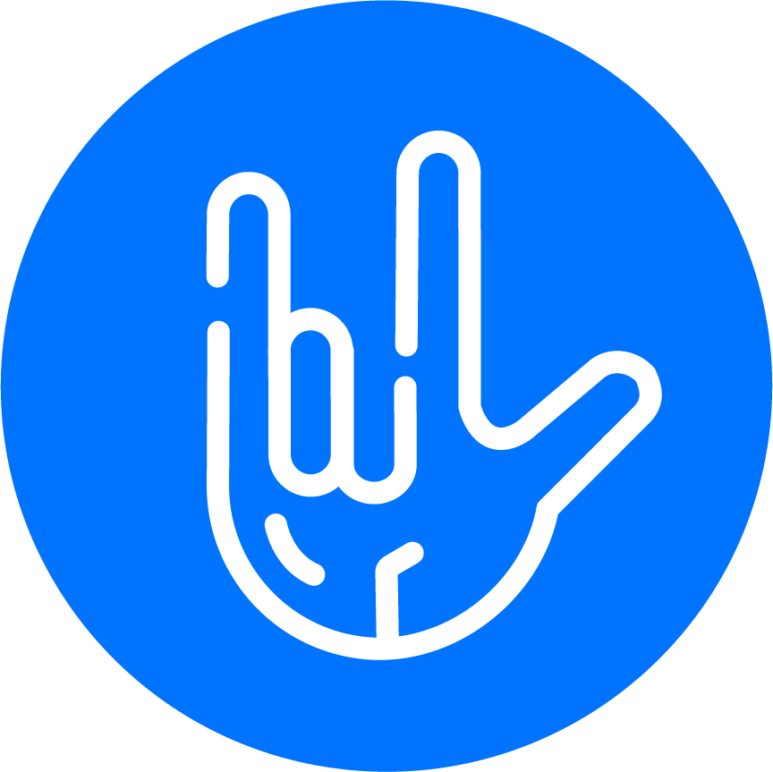
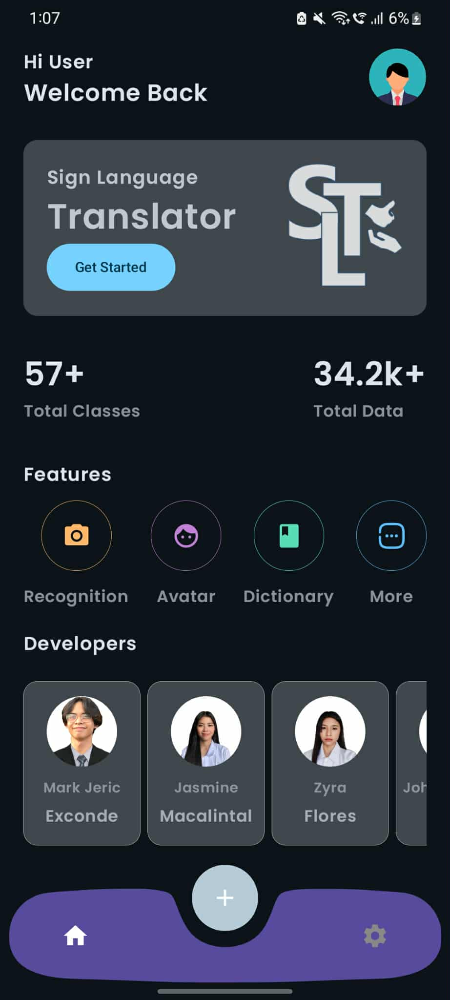
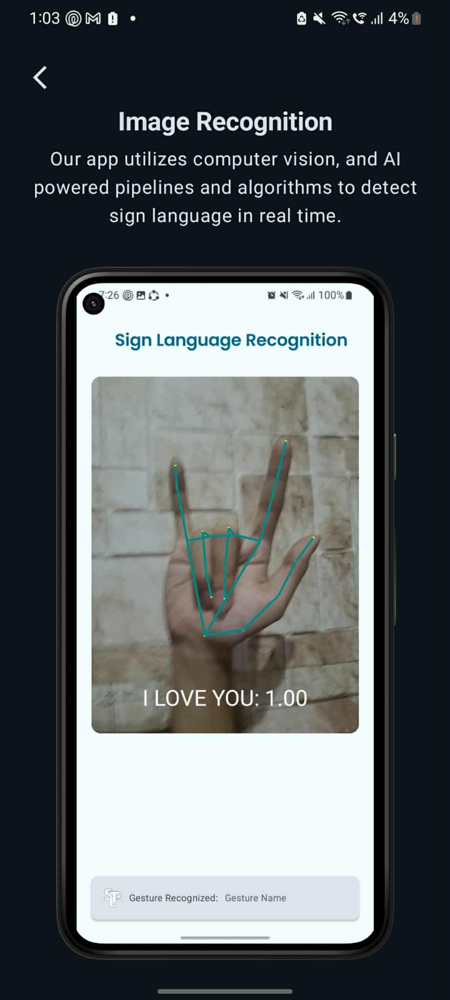
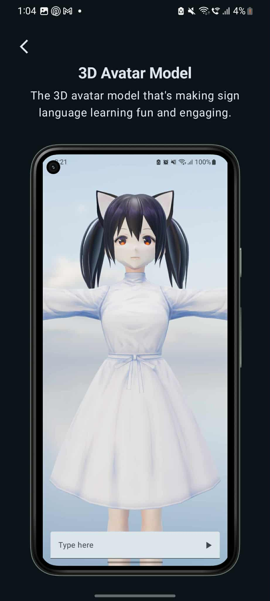
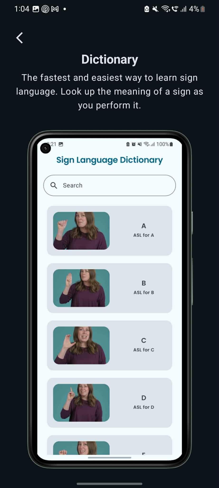
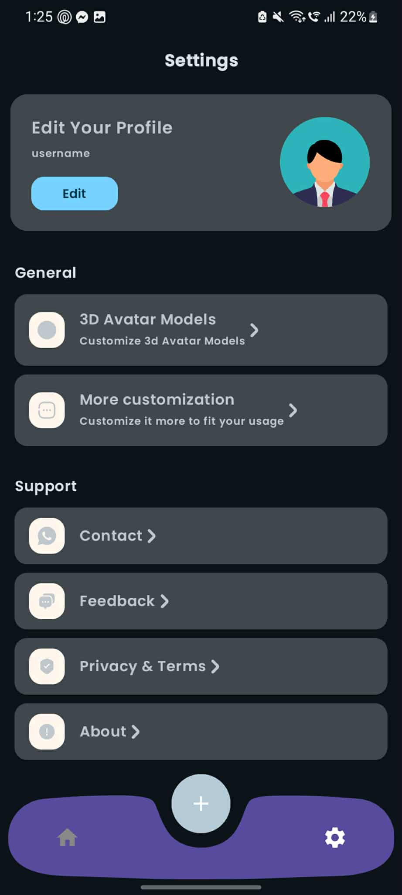

  

# 🖐️ Sign Language Translator App

_A real-time translator bridging communication through technology_

## 📖 Overview
The **Sign Language Translato App** is an Android application built with **Java/Kotlin** and **Jetpack Compose**.  
It enables seamless two-way communication between sign language users and non-signers by combining **computer vision** and **3D visualization**.

---

## ✨ Features
- **🤳 Real-time Sign Recognition**  
  Detects and translates hand sign language gestures via the device camera.  

- **🧑‍🤝‍🧑 3D Avatar Output**  
  Type a word, and a **3D avatar** performs the corresponding sign language gesture.  
  Choose from **multiple avatars** to personalize the experience.  

- **📚 Sign Language Dictionary**  
  Browse a built-in dictionary with pictures and step-by-step instructions on how to perform signs.  

- **🌗 Theme Support**  
  Automatically syncs with your system mode (dark/light), with manual switching available.  

---

## 🎯 How It Works
1. **Sign-to-Text:** Point the camera → app detects the gesture → displays translated text.  
2. **Text-to-Sign:** Type any word → a 3D avatar performs the sign.  
3. **Dictionary Mode:** Browse a collection of signs with images and instructions.  

---

## 📸 Screenshots / Demo

  
  
  
  
  

---

## 📜 License
This project is licensed under the MIT License – see the [LICENSE](LICENSE) file for details.

